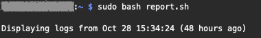
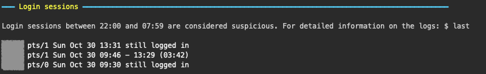
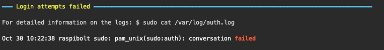
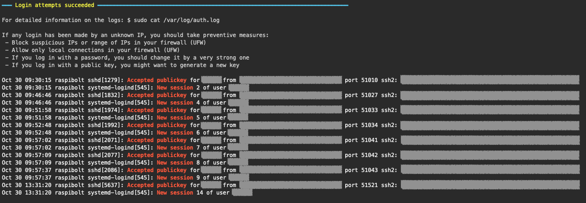
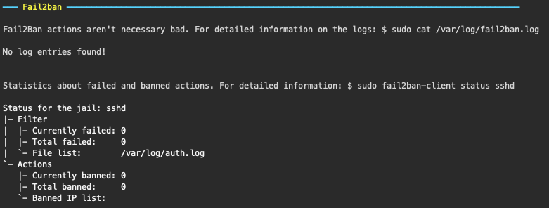
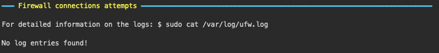
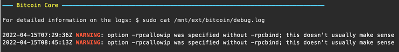
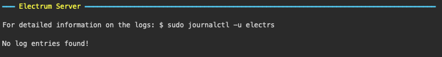
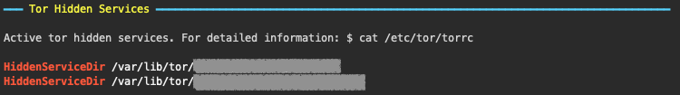

Displays a summary (warnings, errors, etc...) of your raspibolt's environment.

# Contents

- [Contents](#contents)
- [Configuration](#configuration)
  - [Bitcoin data folder's path](#bitcoin-data-folders-path)
- [Arguments](#arguments)
  - [Period in hours to look for events](#period-in-hours-to-look-for-events)
- [Events](#events)
  - [Login sessions](#login-sessions)
  - [Failed login attemps](#failed-login-attemps)
  - [Succeeded login attemps](#succeeded-login-attemps)
  - [Fail2ban actions](#fail2ban-actions)
  - [Firewall connection attempts](#firewall-connection-attempts)
  - [Bitcoin Core](#bitcoin-core)
  - [Electrum Server](#electrum-server)
  - [Tor Hidden Services](#tor-hidden-services)

# Configuration

The script `requires sudo or root privileges` in order to access the logs.

To run the script you'll need to fill in following variables:

1. [pathBitcoin](#bitcoin-data-folders-path)

## Bitcoin data folder's path

Location where Bitcoin's data files are stored:

```sh
pathBitcoin="PATH/TO/BITCOIN/DATA/FOLDER"
```

# Arguments

## Period in hours to look for events

Integer. Default: 48 (hours). The value will be saved in the variable `hoursAgo`.

Look for events in the last day:

```sh
$ sudo bash report.sh 24
```



# Events

## Login sessions

Displays closed and active login sessions.

Logins between 22:00 and 07:59 will be considered suspicious and therefore marked in red. If you want to use different hours, you'll have to modify the RegExp.

Active sessions will we marked in red as well.

Command used to access the logs (see `hoursAgo` in [Arguments](#arguments)):

```
$ last -R -s "-${hoursAgo}hours"
```



## Failed login attemps

Log entries that match the RegExp `Failed|Failure|preauth|Connection closed` will be displayed.

Command used to access the logs:

```
$ cat /var/log/auth.log
```



## Succeeded login attemps

Log entries that match the RegExp `New session|Accepted password|Accepted publickey` will be displayed.

If a successful connection using a password is detected, a warning message will be displayed so that the user considers logging in using a public key.

Command used to access the logs:

```
$ cat /var/log/auth.log
```



## Fail2ban actions

Log entries that match the RegExp `fail2ban\.actions` will be displayed.

If the file `/etc/fail2ban/fail2ban.conf` is not found in your system, a warning message will be displayed.

Command used to access the logs:

```
$ cat /var/log/fail2ban.log
```

Additionally, statistics about failed and banned actions will be displayed:

```
$ sudo fail2ban-client status sshd
```



## Firewall connection attempts

Displays firewall connection attempts excluding broadcast connections "224.0.0." and lines containing 'UFW AUDIT'.

If the file `/etc/ufw/ufw.conf` is not found in your system, a warning message will be displayed.

Command used to access the logs:

```
$ cat /var/log/ufw.log
```



## Bitcoin Core

Log entries that match the RegExp `error|warn(ing)?` will be displayed.

Command used to access the logs (see `pathBitcoin` in [Bitcoin's path](#bitcoins-path)):

```
$ cat "${pathBitcoin}debug.log
```



## Electrum Server

Log entries that match the RegExp `error|warn(ing)?` will be displayed.

Command used to access the logs (see `hoursAgo` in [Arguments](#arguments)):

```
$ journalctl -u electrs --since="${hoursAgo} hours ago"
```



## Tor Hidden Services

Entries that match the RegExp `^HiddenServiceDir` will be displayed.

Command used to access tor configuration:

```
$ cat /etc/tor/torrc
```


